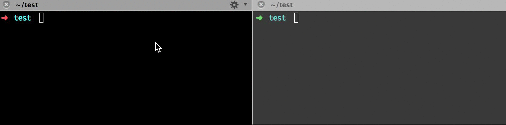

wt
================

wt stands for "watch-then".

wt watches your `folder/file`, when changes the folder/file then execute commands.

HOW TO USE
-----------------

```shell
$ wt <filepath> <command> [interval (second, default 1sec)]
```

```shell
$ wt . "go test"
```

HOW TO INSTALL
-----------------

[DOWNLOAD FROM HERE](https://github.com/yosuke-furukawa/wt/releases)

DEMO
-----------------



LICENSE
-----------------

MIT
